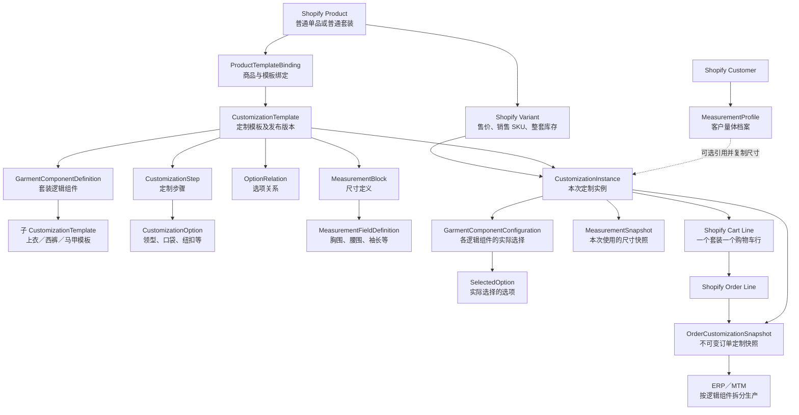

# 核心 Domain 与关系说明

## 1. 文档目的

本文解释 Shopify 服装定制一期的核心 Domain、聚合关系、数据边界和端到端流程。

当前方案采用：

```text
普通 Shopify 套装商品
+ Shopify Variant 确定基础售价、销售 SKU 和整套库存
+ Line Item Properties 展示定制摘要并保存配置 ID
+ D1 保存完整定制实例
+ 订单快照供 ERP/MTM 按逻辑组件拆分生产
```

本方案不使用 Shopify Fixed Bundle。上衣、西裤和马甲是定制与生产领域中的逻辑组件，不是 Shopify 独立商品。

本文描述的是目标 Domain。对应改造任务当前仍处于待实施状态，不能将全部模型视为已经完成开发。

## 2. 核心关系概览



模型的核心原则是把以下数据分开：

- 运营定义的模板；
- 消费者本次选择；
- 客户可修改的量体档案；
- 下单时不可变的订单快照。

这样可以避免模板或量体档案修改后影响历史订单。

## 3. CustomizationTemplate：定制规则定义

`CustomizationTemplate` 是定制定义的聚合根，描述商品允许如何定制，不保存某位消费者的实际选择。

它包含：

- 模板编码、名称和适用品类；
- 单品或组合模板类型；
- 套装逻辑组件；
- 定制步骤；
- 可选项；
- 选项关系；
- 尺寸块和尺寸字段；
- 草稿、发布状态及版本。

例如，两件套组合模板可以表示为：

```text
CustomizationTemplate: mens_suit_2pc
├── GarmentComponentDefinition: jacket
│   └── childTemplateId: jacket_template
└── GarmentComponentDefinition: trousers
    └── childTemplateId: trousers_template
```

### 3.1 模板版本

每次发布都生成不可变版本：

```text
mens_suit_2pc v1
mens_suit_2pc v2
mens_suit_2pc v3
```

消费者创建定制实例时必须记录具体版本，不能只引用当前模板。商品绑定也可以指定已发布版本，保证 Storefront 和历史订单使用明确配置。

## 4. GarmentComponentDefinition：套装逻辑组件

`GarmentComponentDefinition` 描述普通套装商品内部包含的固定服装组件。

```ts
type GarmentComponentDefinition = {
  id: string;
  code: string;
  name: string;
  category: GarmentCategory;
  childTemplateId: string;
  customizationEnabled: boolean;
  sortOrder: number;
};
```

例如三件套：

```text
普通 Shopify 商品：男士定制西服三件套
└── 组合模板
    ├── jacket    → 上衣定制模板
    ├── trousers  → 西裤定制模板
    └── waistcoat → 马甲定制模板
```

逻辑组件不包含：

- Shopify 组件 Product ID；
- 组件 Variant；
- 组件价格；
- 组件库存；
- 组件履约信息。

Shopify 只识别整个套装商品。逻辑组件最终由 ERP/MTM 根据订单快照拆分成生产任务。

组合模板通过唯一的 `components` 类型步骤明确整组组件定制在顾客流程中的位置。具体包含哪些组件、组件顺序及其 `childTemplateId` 统一由“组合/套装”配置维护，步骤本身不重复引用单个组件。Storefront 遇到该占位步骤时，按组件排序依次展开所有启用组件的单品模板步骤。

两件套和三件套应分别建立普通 Shopify 商品及组合模板，消费者不能在定制过程中任意增加或删除组件。

## 5. CustomizationStep 与 CustomizationOption

### 5.1 CustomizationStep

`CustomizationStep` 表示定制流程中的一个步骤，例如：

```text
面料与版型
→ 上衣领型
→ 纽扣
→ 口袋
→ 西裤款式
→ 量体尺寸
→ 配置确认
```

步骤负责定义：

- 稳定编码；
- 标题和说明；
- 步骤类型；
- 是否必填；
- 是否启用；
- 排序；
- 展示方式。

### 5.2 CustomizationOption

`CustomizationOption` 表示步骤中的具体选择：

```text
步骤：lapel
├── notch_lapel  平驳领
├── peak_lapel   戗驳领
└── shawl_lapel  青果领
```

系统关联使用稳定英文编码，中文名称用于展示：

```text
optionCode = peak_lapel
optionName = 戗驳领
```

一期所有选项均满足：

```ts
affectsPrice: false
```

领型、纽扣、口袋、刺绣及量体数据都不会修改 Shopify Variant 价格。

## 6. OptionRelation：定制选项关系

`OptionRelation` 描述不同步骤和选项之间的联动规则。

一期支持：

```text
show         显示
hide         隐藏
enable       启用
disable      禁用
exclude      互斥
auto_select  自动选择
```

例如：

```text
选择“无内衬”
→ 隐藏“内衬颜色”

选择“双排扣”
→ 禁用“单粒扣”

选择“礼服款”
→ 自动选择“缎面戗驳领”
```

关系必须通过稳定编码建立：

```text
sourceStepCode + sourceOptionCode
→ targetStepCode + targetOptionCode
```

不能使用展示名称建立关系，因为中文名称可能被运营修改。

## 7. MeasurementBlock 与 MeasurementFieldDefinition

`MeasurementBlock` 表示一组尺寸定义，例如上衣尺寸、西裤尺寸或通用身体尺寸。

`MeasurementFieldDefinition` 表示具体字段，例如：

```text
上衣尺寸
├── chest         胸围
├── shoulder      肩宽
└── sleeve_length 袖长

西裤尺寸
├── waist          腰围
├── hip            臀围
└── trouser_length 裤长
```

字段定义包含最小值、最大值、步长、标准单位、说明、图片、排序、启停和必填规则。它只定义如何采集尺寸，不保存客户的实际尺寸。

## 8. MeasurementProfile：客户量体档案

`MeasurementProfile` 是 Shopify Customer 长期保存的一套尺寸资料。

```text
Shopify Customer
├── 本人尺寸
├── 夏季尺寸
└── 父亲尺寸
```

一个客户可以拥有多套档案。尺寸同时保存标准 CM 值、用户输入值和输入单位：

```json
{
  "fieldCode": "waist",
  "valueInCm": 81.28,
  "inputValue": 32,
  "inputUnit": "IN"
}
```

`MeasurementProfile` 是可修改的客户资料，不能直接作为历史订单尺寸。创建定制实例时需要复制本次使用的尺寸，形成独立快照。

## 9. CustomizationInstance：消费者本次定制

`CustomizationInstance` 是消费者数据的聚合根，记录消费者针对某个 Shopify Variant 的一次实际定制过程。

它包含：

- Shopify Product ID 和 Variant ID；
- 模板 ID、编码和版本；
- Shopify Customer ID，可为空；
- 各逻辑组件配置；
- 实际选择的选项；
- 量体档案来源；
- 本次尺寸快照；
- 当前状态。

状态流转为：

```text
editing
→ validated
→ added_to_cart
→ ordered
```

示例：

```text
configId: cus_123
商品: 男士定制西服两件套
Variant: 藏青 / 标准版
模板: mens_suit_2pc@4

组件配置:
├── jacket
│   ├── 领型: peak_lapel
│   ├── 纽扣: two_button
│   └── 口袋: flap_pocket
└── trousers
    └── 裤型: flat_front
```

定制实例是连接 Shopify 商品、模板版本、客户量体数据和订单的核心业务对象。

## 10. GarmentComponentConfiguration：实际组件配置

`GarmentComponentDefinition` 是模板中的组件定义，`GarmentComponentConfiguration` 是消费者实际选择的组件结果。

```text
模板定义
GarmentComponentDefinition: jacket
        ↓ 消费者完成配置
实例结果
GarmentComponentConfiguration: jacket
```

每个实际组件配置保存：

- 组件稳定编码；
- 下单时的组件名称；
- 实际选择的选项；
- 适用的尺寸快照。

ERP/MTM 可以根据这些配置分别生成：

```text
上衣生产任务
西裤生产任务
马甲生产任务
```

但 Shopify 购物车和订单中仍然只有一个普通套装商品行。

## 11. SelectedOption：实际选择结果

`SelectedOption` 保存消费者在某个组件和步骤中的实际选择。

它同时保存：

- 步骤稳定编码；
- 选项稳定编码；
- 下单时步骤名称；
- 下单时选项名称。

稳定编码供系统校验和 ERP/MTM 使用，名称用于购物车、订单和历史记录展示。即使运营以后修改中文名称，历史快照仍保留下单时的显示内容。

## 12. OrderCustomizationSnapshot：订单快照

`OrderCustomizationSnapshot` 是下单后形成的最终不可变业务凭证。

订单不能只保存以下引用：

```text
templateId
measurementProfileId
```

因为模板和量体档案以后都可能修改。订单快照需要复制并固化：

- Shopify Order ID；
- Shopify Line Item ID；
- 配置实例 ID；
- Product/Variant；
- 模板编码和版本；
- 组件编码和下单时名称；
- 选项编码和下单时名称；
- 标准尺寸、输入值和输入单位；
- 完整生产配置。

关系如下：

```text
CustomizationInstance
→ 加入购物车
→ Shopify Order Line
→ OrderCustomizationSnapshot
→ ERP/MTM
```

即使运营删除选项、发布新模板，或者客户更新量体档案，历史订单仍可以准确还原。

## 13. ProductTemplateBinding：商品绑定

`ProductTemplateBinding` 控制某个 Shopify 商品是否启用定制，以及使用哪个已发布模板版本。

```text
Shopify Product
        ↓
ProductTemplateBinding
        ↓
已发布 CustomizationTemplate
```

商品定制功能的启用条件为：

```text
存在商品绑定
+ binding.enabled = true
+ 模板状态为 published
= 商品支持定制
```

没有绑定、绑定停用或模板未发布时，Storefront API 返回：

```json
{
  "enabled": false,
  "configuration": null
}
```

D1 查询失败、模板 JSON 损坏或服务异常不能伪装为 `enabled: false`，必须返回可识别的错误。

## 14. Shopify 与 Domain 的职责边界

### 14.1 Shopify 负责

- 普通单品或普通套装 Product；
- Shopify Variant；
- 整套价格；
- 销售 SKU；
- 整套库存；
- Cart、Checkout 和订单；
- 一个套装对应一个 Cart Line 和 Order Line。

### 14.2 定制 Domain 负责

- 套装内部逻辑组件；
- 定制模板和发布版本；
- 定制步骤、选项和联动关系；
- 尺寸字段定义；
- 客户量体档案；
- 消费者本次定制实例；
- 订单定制快照；
- ERP/MTM 生产拆分数据。

### 14.3 明确限制

Shopify 原生库存、订单、履约、退货和报表只识别整个套装商品，不能原生按上衣、西裤和马甲分别处理。

如果后续业务要求组件级 SKU、组件库存、组件履约或组件退货，应建立独立任务重新评估 Shopify Fixed Bundle，不能在当前模型中隐式模拟 Bundle。

## 15. Line Item Properties 与 D1 的数据分层

Line Item Properties 只保存消费者可读摘要和稳定关联字段，例如：

```text
定制类型：两件套
上衣领型：戗驳领
西裤裤型：无褶
_mtm_customization_id：cus_123
_mtm_template：mens_suit_2pc@4
```

D1 保存完整数据：

- 全部逻辑组件；
- 全部选项编码和名称；
- 完整量体尺寸；
- 模板版本；
- 校验状态；
- 订单关联；
- 不可变订单快照。

不能把完整配置 JSON 或完整客户尺寸写入 Line Item Properties。

## 16. 端到端数据流

```text
运营创建并发布定制模板
→ 普通 Shopify 商品绑定指定模板版本
→ Storefront 读取已发布配置
→ 消费者创建 CustomizationInstance
→ 按逻辑组件选择定制选项
→ 从 MeasurementProfile 复制本次尺寸快照
→ 服务端校验模板版本、组件、选项关系和尺寸
→ 普通套装 Variant 加入购物车
→ Line Item Properties 保存摘要和配置 ID
→ Shopify Checkout 以原始 Variant 价格下单
→ orders/create Webhook 关联配置实例
→ 创建不可变 OrderCustomizationSnapshot
→ ERP/MTM 按逻辑组件拆分生产任务
```

## 17. 相关文档

- `doc/tasks/domain-model-rework.md`：Domain 改造范围、实施步骤与完成标准；
- `doc/domain-model-overview.puml`：核心 Domain 概览；
- `doc/domain-model.puml`：完整 Domain 类关系；
- `doc/shopify-integration-api.md`：Shopify、Storefront API、购物车和订单对接方案。
