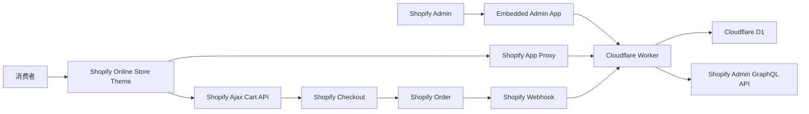
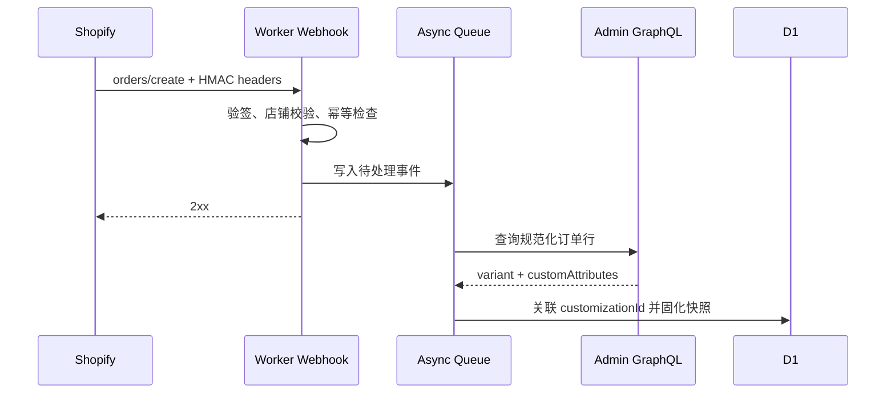

# Shopify 对接与 API 方案

## 1. 文档目的

本文定义服装定制系统与 Shopify 的对接边界、认证方式、API 契约和异常处理策略，重点说明：

- Shopify Product、Variant 与定制模板如何关联；
- 普通 Shopify 套装商品如何映射上衣、西裤、马甲等逻辑组件；
- 商品页如何读取定制配置并把结果加入购物车；
- Line Item Properties 如何进入订单；
- 后端如何通过 Webhook 和 Admin GraphQL 获取可靠订单数据；
- 管理端、主题端和 Cloudflare Worker 分别使用哪种身份访问接口。

本文是目标方案，不代表所有接口均已完成开发。标记为“一期实现”的内容属于当前交付边界；标记为“后续扩展”的内容不得在一期上线验收中视为已实现。

## 2. 一期关键决策

1. 一期所有定制项均不改变价格，成交价完全由 Shopify Variant 决定。
2. 单品和套装都使用普通 Shopify Product/Variant；两件套、三件套分别建立独立的普通套装商品。
3. Shopify 只维护整个套装 Variant 的售价、销售 SKU 和套装库存，不识别上衣、西裤、马甲等内部逻辑组件。
4. 主题只把普通套装 Variant 加入购物车并形成一个 Cart Line，不分别添加组件商品。
5. Line Item Properties 只保存订单展示摘要和稳定的配置实例 ID；完整配置快照保存在 D1。
6. Storefront API 使用明确的 `enabled + configuration` 响应，不再使用 `PurchaseMode`。
7. 一期不使用 Shopify Bundle 或 Cart Transform Function，不支持消费者任意增删套装组件。
8. Shopify Admin API Token、App Secret 等凭据只保存在 Cloudflare Secret 中，绝不进入主题代码、浏览器响应、日志或文档示例。

## 3. 总体架构



### 3.1 系统职责

| 系统 | 负责内容 | 不负责内容 |
| --- | --- | --- |
| Shopify | 普通单品/套装商品、Variant、整套价格和库存、购物车、Checkout、订单、客户账号 | 套装内部逻辑组件、定制步骤、选项关系、量体字段定义、完整定制快照 |
| Cloudflare Worker/D1 | 模板配置、商品绑定、逻辑组件模板映射、定制实例、量体档案、订单定制快照 | 覆盖 Shopify 成交价、维护 Shopify 库存 |
| Shopify Theme | 定制入口、弹层交互、配置回显、调用 Storefront API、Ajax 加购 | 持有 Admin Token、直接访问 D1、在浏览器内信任或校验价格 |
| Embedded Admin App | 运营配置模板、发布版本、绑定商品、查看校验结果 | 取代 Shopify 商品和订单后台 |

## 4. Shopify 资源与本项目模型的映射

### 4.1 单品

```text
Shopify Product
  └── Shopify Variant              商品价格与可售单元
        └── Product Binding        是否启用定制、绑定哪个模板版本
              └── Template        定制步骤、选项、尺寸定义
                    └── Customization Instance
```

- `Product ID` 用于查找商品绑定。
- `Variant ID` 用于 Ajax Cart 加购，并进入 Shopify Cart/Order。
- 颜色、尺码如果是库存或价格维度，应建成 Shopify Variant Option。
- 领型、袖长、裤长、绣字等不影响价格和库存的个性化数据，作为定制选项保存，不创建大量 Variant。

### 4.2 普通套装商品

```text
Shopify Suit Product
  └── Shopify Suit Variant         整套售价、销售SKU和库存

Customization Template
  ├── Logical Component: Jacket -> Jacket Child Template
  ├── Logical Component: Trousers -> Trousers Child Template
  └── Logical Component: Waistcoat -> Waistcoat Child Template（三件套）
```

两件套和三件套是不同的普通 Shopify 商品，并分别绑定对应组合模板。逻辑组件属于定制和生产模型，不是 Shopify 独立 Product/Variant。定制系统按模板展开固定组件并保存完整配置，订单快照供 ERP/MTM 拆分生产任务。

该模型接受以下边界：Shopify 原生库存、订单、履约、退货和报表只识别整个套装，不能按上衣、西裤、马甲分别处理。若未来需要组件级 SKU、库存或履约，应另行评估 Shopify Fixed Bundle。

## 5. API 版本与调用约定

### 5.1 Admin GraphQL API

服务端调用地址：

```text
POST https://{shop-domain}/admin/api/{api-version}/graphql.json
```

请求头：

```http
Content-Type: application/json
X-Shopify-Access-Token: <server-side-token>
```

规则：

- 代码中固定明确版本，不使用 `latest`；版本通过受控配置升级。
- 每个季度检查 Shopify API 版本支持周期、弃用字段和 Webhook 版本。
- GraphQL HTTP 200 不代表业务成功，必须同时检查顶层 `errors` 和 mutation 的 `userErrors`。
- 读取响应中的 `extensions.cost.throttleStatus`，接近限流时退避重试。
- 查询使用 Shopify GID，例如 `gid://shopify/Product/{id}`；浏览器 Ajax Cart 使用数字 Variant ID。边界层必须显式转换，不在 Domain 中混用两种格式。

### 5.2 建议的最小权限

| Scope | 使用场景 | 一期是否需要 |
| --- | --- | --- |
| `read_products` | 查询普通单品/套装 Product 和 Variant | 是 |
| `write_products` | 由应用创建或修改商品 | 一期不需要；商品由 Shopify 后台维护 |
| `read_orders` | Webhook 后补查订单及读取 `customAttributes` | 是 |
| `read_customers` | 后端补充查询客户资料 | 按需；量体档案不应仅凭该权限开放 |
| `write_cart_transforms` | 动态拆分或合并购物车组件 | 一期不需要 |

权限遵循最小化原则。一期由运营在 Shopify 后台维护普通单品和套装商品，应用只读商品结构，不申请 `write_products`。

## 6. 身份认证方案

### 6.1 Embedded Admin App

管理页面运行在 Shopify Admin iframe 中：

1. 前端通过 Shopify App Bridge 获取短期 Session Token。
2. 前端请求本项目管理 API 时发送 `Authorization: Bearer <session-token>`。
3. Worker 验证 Token 的签名、签发方、受众、过期时间和目标店铺。
4. Worker 使用服务端保存的 offline access token 调用 Admin GraphQL API。

浏览器不得获得 Admin API access token。生产环境建议使用 Shopify OAuth/Token Exchange 完成安装和换取访问令牌，不使用人工复制 Token 作为长期方案。

### 6.2 Storefront App Proxy

主题读取定制配置时，推荐访问店铺同源路径：

```text
GET /apps/mtm/config/{product-id}
```

Shopify App Proxy 将请求转发给 Worker，并增加：

- `shop`；
- `logged_in_customer_id`；
- `path_prefix`；
- `timestamp`；
- `signature`。

Worker 必须使用 App Secret 验证 `signature`，校验时间窗口，并验证 `shop` 属于已安装店铺。App Proxy 不转发 Cookie，因此不能用普通 Cookie Session 判断客户身份。

读取或修改量体档案时，还必须验证资源所属客户与 `logged_in_customer_id` 一致。签名只能证明请求经过 Shopify，不能自动证明客户有权访问任意档案 ID。

### 6.3 Webhook

Webhook 接收端必须：

1. 在解析 JSON 前保留原始请求体；
2. 使用 App Secret 校验 `X-Shopify-Hmac-SHA256`；
3. 校验店铺、Topic 和 API 版本；
4. 使用 `X-Shopify-Webhook-Id` 或事件 ID 做幂等去重；
5. 快速返回成功，将订单补查和快照落库放入异步任务；
6. 限制请求体大小，不记录完整量体数据和认证头。

## 7. 普通商品 API

### 7.1 查询单品或套装 Product/Variant

用途：管理端绑定商品时校验 ID、标题、发布状态和 Variant。

```graphql
query ProductForBinding($id: ID!) {
  product(id: $id) {
    id
    title
    handle
    status
    variants(first: 100) {
      nodes {
        id
        title
        sku
        price
      }
    }
  }
}
```

保存绑定时应保存稳定 Shopify ID；标题和 Handle 只作为展示缓存，不能作为外键。

### 7.2 套装商品与逻辑组件校验

发布组合模板或同步商品绑定时，只校验 Shopify 中存在可销售的普通套装 Product/Variant。上衣、西裤、马甲等逻辑组件完全由已发布模板定义，不调用 Shopify Bundle API，也不要求逻辑组件具备 Shopify Product ID。

校验规则：

- 商品绑定指向的普通套装 Product 存在且状态满足发布要求；
- 至少存在一个可用于加购的套装 Variant；
- 两件套、三件套分别绑定结构匹配的组合模板；
- 每个启用的逻辑组件编码唯一，且其 `childTemplateId` 指向可用的单品模板；
- 定制实例必须包含组合模板要求的全部必需逻辑组件；
- Shopify 套装 Variant 变化不修改历史订单快照，新配置发布前重新校验商品及模板；
- 管理端不得把逻辑组件描述为 Shopify 库存或履约单元。

## 8. 本项目 Storefront API

以下路径表示 Worker 原始 API；正式主题可通过 App Proxy 映射为店铺同源路径。

### 8.1 获取商品定制配置

```http
GET /api/storefront/config/{shopify-product-id}
```

无有效定制配置时仍返回 HTTP 200：

```json
{
  "enabled": false,
  "configuration": null
}
```

存在已启用、已发布配置时：

```json
{
  "enabled": true,
  "configuration": {
    "templateCode": "mens-suit",
    "templateVersion": 4,
    "buttonText": "开始定制",
    "templateType": "single",
    "components": [],
    "steps": []
  }
}
```

语义：

- 未绑定、绑定停用、模板未发布：`200 + enabled:false`；
- Product ID 格式非法：`400`；
- App Proxy 签名非法或来源店铺不可信：`401/403`；
- D1 或服务异常：`500`，不得伪装成 `enabled:false`。

返回值只包含前台展示需要的数据，不返回草稿、审计字段、内部规则备注或其他店铺配置。

### 8.2 校验本次定制

```http
POST /api/storefront/validate
Content-Type: application/json
```

请求示例：

```json
{
  "productId": "gid://shopify/Product/123",
  "variantId": "gid://shopify/ProductVariant/456",
  "templateCode": "mens-suit",
  "templateVersion": 4,
  "components": [
    {
      "componentCode": "jacket",
      "selections": [
        { "stepCode": "lapel", "optionCode": "notch" }
      ]
    }
  ]
}
```

响应示例：

```json
{
  "valid": true,
  "errors": []
}
```

服务端必须根据请求中的模板版本校验选项编码、必填项、组件归属和选项关系，不能信任浏览器传入的 Label。

### 8.3 创建配置实例（一期正式化时新增）

```http
POST /api/storefront/customizations
```

建议流程：先校验，再创建不可猜测的 `customizationId`，保存完整配置快照并返回购物车摘要。

```json
{
  "customizationId": "cus_01J...",
  "status": "validated",
  "summary": {
    "定制类型": "Bespoke",
    "上衣领型": "Notch Lapel",
    "裤脚": "Standard Hem"
  }
}
```

写接口必须具备签名校验、幂等键、并发控制和请求体大小限制。当前 POC 若尚未实现该端点，主题只能使用现有校验结果加购，不应宣称已具备生产级订单快照追踪。

## 9. Ajax Cart API 与 Line Item Properties

### 9.1 加入购物车

Online Store Theme 使用 Shopify Ajax Cart API，不通过 Admin API 创建购物车：

```js
const payload = {
  items: [
    {
      id: productVariantNumericId,
      quantity: 1,
      properties: {
        "定制类型": "Bespoke",
        "上衣领型": "Notch Lapel",
        "裤脚": "Standard Hem",
        "_mtm_customization_id": "cus_01J...",
        "_mtm_template": "mens-suit@4"
      }
    }
  ]
};

await fetch(window.Shopify.routes.root + "cart/add.js", {
  method: "POST",
  headers: { "Content-Type": "application/json" },
  body: JSON.stringify(payload)
});
```

规则：

- `id` 是当前普通单品或套装商品的数字 Variant ID。
- 中文展示字段会显示在购物车和订单中。
- 以下划线开头的字段作为内部属性，主题必须显式隐藏，但 Shopify Admin 仍可查看。
- 不把完整 JSON、全部尺寸或敏感个人数据塞入 Line Item Properties。
- 属性不同的相同 Variant 会成为不同购物车行，符合“一套定制对应一行”的语义。
- 使用 `window.Shopify.routes.root` 生成多语言店铺兼容路径。

### 9.2 返回编辑

编辑完成后使用：

```text
POST /{locale}/cart/change.js
```

以购物车行 `key` 定位目标行。更新 `properties` 时 Shopify 会替换整个属性对象，因此前端必须提交完整的新属性集合，不能只提交变化字段。属性改变后购物车行 `key` 可能变化，应使用响应中的新值刷新页面状态。

### 9.3 数据分层

| 数据 | Shopify Line Item Properties | D1 配置快照 |
| --- | --- | --- |
| 消费者可读摘要 | 保存 | 保存 |
| `customizationId` | 保存 | 主键 |
| 模板代码和版本 | 保存简写 | 完整保存 |
| 全部选项编码 | 可不保存 | 保存 |
| 完整量体数据 | 不保存 | 受权限保护保存 |
| 订单关联 | Shopify 自动形成 | Webhook 后补写 |

## 10. 订单与 Webhook 对接

### 10.1 推荐订阅

| Topic | 用途 | 一期 |
| --- | --- | --- |
| `orders/create` | 固化订单定制快照、关联 Order/Line Item | 必须 |
| `orders/updated` | 同步订单变更或取消后的关联状态 | 建议 |
| `app/uninstalled` | 清理店铺凭据、停用店铺配置 | 必须 |

Webhook subscription 优先声明在应用配置中；若需要按店铺动态创建，则通过 Admin GraphQL `webhookSubscriptionCreate` 管理。

### 10.2 Webhook 处理流程



Webhook payload 用于触发事件；Worker 通过 Admin GraphQL 补查规范化订单行及定制属性，再用 `_mtm_customization_id` 关联 D1 配置实例。

### 10.3 查询订单定制属性

```graphql
query OrderCustomization($id: ID!) {
  order(id: $id) {
    id
    name
    createdAt
    customer {
      id
    }
    lineItems(first: 100) {
      nodes {
        id
        title
        sku
        quantity
        customAttributes {
          key
          value
        }
        variant {
          id
        }
      }
    }
  }
}
```

普通套装商品在订单中只有一个 Shopify Line Item。系统从该行的 `_mtm_customization_id` 关联 D1 配置实例，并创建包含全部逻辑组件、选项编码、展示名称和尺寸值的不可变 `OrderCustomizationSnapshot`。ERP/MTM 从该快照拆分上衣、西裤和马甲生产任务，不能只靠商品标题、SKU 或可读摘要还原生产配置。

## 11. 量体档案与客户身份

量体档案属于本项目业务数据，不建议塞入 Shopify Customer Metafield 作为唯一存储。建议模型：

```text
Shopify Customer ID
  └── Measurement Profile 1..N in D1
```

接口建议：

```text
GET    /api/storefront/measurement-profiles
POST   /api/storefront/measurement-profiles
GET    /api/storefront/measurement-profiles/{id}
PUT    /api/storefront/measurement-profiles/{id}
DELETE /api/storefront/measurement-profiles/{id}
```

所有接口都必须通过可信 Shopify 客户身份执行对象级权限校验。不得仅根据前端传入的 `customerId` 查询数据，也不得把完整量体数据写入日志、Webhook 去重表或 Line Item Properties。

## 12. 错误、重试与幂等

### 12.1 统一错误结构

本项目 API 使用稳定的错误格式：

```json
{
  "error": {
    "code": "INVALID_CUSTOMIZATION",
    "message": "定制配置校验失败",
    "details": [
      { "path": "components.jacket.lapel", "reason": "OPTION_DISABLED" }
    ]
  }
}
```

对外响应不得包含堆栈、SQL、Token、App Secret 或 Shopify 原始敏感响应。

### 12.2 重试策略

- Admin GraphQL 查询：仅对限流、网络失败和可重试的 5xx 使用指数退避；mutation 重试必须有业务幂等键或先查询操作状态。
- Webhook：以 Webhook/Event ID 去重，同一个事件重复投递返回成功，不重复创建订单快照。
- Storefront 写接口：接受 `Idempotency-Key`，相同客户、商品和请求体重复提交返回同一配置实例。
- Ajax Cart：网络结果未知时先读取 `/cart.js` 核对，不盲目重复加购。

## 13. Cloudflare 配置

只记录变量名，不记录真实值：

| 配置 | 类型 | 用途 |
| --- | --- | --- |
| `DB` | D1 binding | 模板、绑定、定制实例、量体档案、订单快照 |
| `SHOPIFY_API_VERSION` | Variable | 固定的 Admin API 版本 |
| `SHOPIFY_APP_CLIENT_ID` | Variable/Secret | App 身份 |
| `SHOPIFY_APP_SECRET` | Secret | App Proxy、Webhook、Session Token 验签 |
| `SHOPIFY_ADMIN_ACCESS_TOKEN` | Secret（POC） | 单店 POC 调用 Admin API；生产改为按店铺安全存储 OAuth Token |
| `SHOPIFY_ALLOWED_SHOPS` | Variable | 允许访问的店铺集合或租户配置引用 |
| `STOREFRONT_ALLOWED_ORIGINS` | Variable | 不使用 App Proxy 时的严格 CORS 白名单 |

生产环境不得把真实店铺域名、Token、数据库 ID 或 Secret 提交到 Git。

## 14. 一期端到端流程

### 14.1 发布配置

1. 运营在 Shopify 创建普通单品或普通套装商品；两件套、三件套分别建商品。
2. 管理应用通过 Admin GraphQL 查询并校验 Product 和 Variant。
3. 运营为商品绑定模板；组合模板中的固定逻辑组件映射到各自子模板。
4. 发布前校验 Shopify 资源存在、逻辑组件完整、子模板、选项和关系合法。
5. D1 保存不可变模板版本，并启用 Product Binding。

### 14.2 商品页定制与加购

1. Theme 通过 App Proxy 请求商品配置。
2. `enabled:false` 时不显示定制按钮；原生购买保持不变。
3. `enabled:true` 时打开多步骤定制器。
4. Theme 调用服务端校验，并创建/获取 `customizationId`。
5. Theme 通过 Ajax Cart API 加入当前普通单品或套装 Variant，并形成一个购物车行。
6. 购物车显示摘要，内部属性关联 D1 完整配置。

### 14.3 下单与回流

1. Shopify Checkout 使用原始 Variant 价格完成下单。
2. Shopify 投递 `orders/create` Webhook。
3. Worker 验签、去重并异步补查 Admin GraphQL Order。
4. 系统读取订单行 `customAttributes`，通过 `_mtm_customization_id` 关联 D1 配置实例。
5. 创建包含全部逻辑组件的不可变 `OrderCustomizationSnapshot`，供 ERP/MTM 拆分生产任务。

## 15. 一期不使用的 Shopify API

| API/能力 | 不使用原因 |
| --- | --- |
| Storefront GraphQL Cart API | 当前是 Shopify Online Store Theme，Ajax Cart API 更直接；Headless Storefront 才需要重新评估 |
| Shopify Fixed Bundle / Bundles API | 一期把整套作为一个普通销售商品，组件只存在于定制和生产模型中 |
| Cart Transform Function | 一期不在购物车拆分逻辑组件，也没有动态 Mix-and-match 需求 |
| Draft Order API | 正常消费者订单通过 Checkout 产生，不绕过标准购买链路 |
| Checkout UI Extension | 一期定制在 PDP 完成，不在 Checkout 修改配置 |
| Shopify Functions 动态定价 | 一期定制不影响价格 |
| 将每个定制组合创建为 Variant | 会造成 Variant 爆炸，且与定制数据语义不符 |

## 16. 验收清单

- 普通商品无绑定时，Storefront API 返回 `enabled:false`，PDP 不显示定制按钮。
- 普通商品有有效绑定时，可定制、校验、加购，订单行保留摘要和配置 ID。
- 普通套装商品能够按组合模板分别展示上衣、西裤及马甲的子定制步骤。
- 套装加购只提交一个普通套装 Variant，并形成一个购物车行。
- Shopify 订单行通过配置 ID 关联 D1 快照，ERP/MTM 能从快照稳定拆分逻辑组件。
- 定制属性不改变商品、购物车或 Checkout 价格。
- App Proxy、Webhook 和管理端请求均完成对应签名或 Token 校验。
- Webhook 重复投递不会重复生成订单快照。
- 量体档案只能由所属 Shopify Customer 读取和修改。
- 任何浏览器响应、日志和 Git 文件中都不存在 Admin Token 或 App Secret。

## 17. Shopify 官方参考

- [Admin GraphQL `Product`](https://shopify.dev/docs/api/admin-graphql/latest/objects/Product)
- [Admin GraphQL `ProductVariant`](https://shopify.dev/docs/api/admin-graphql/latest/objects/ProductVariant)
- [Shopify Ajax Cart API](https://shopify.dev/docs/api/ajax/reference/cart)
- [App Proxy 请求认证](https://shopify.dev/docs/apps/build/online-store/app-proxies/authenticate-app-proxies)
- [Webhook API](https://shopify.dev/docs/api/webhooks/latest)
- [App Token Exchange](https://shopify.dev/docs/apps/build/authentication-authorization/access-tokens/token-exchange)
